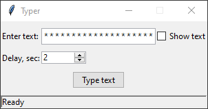

# Typer

Simple tool to transfer text if you don't have accsess to the clipboard. For example, if you have to enter your 60 character steam password every time you start a Geforce Now session, this is the tool for you



## Installation

Install [poetry](https://python-poetry.org/), then

```console
poetry install
```

## Usage

```console
python typer.py
```
